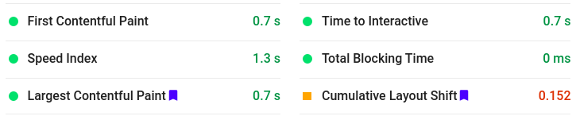
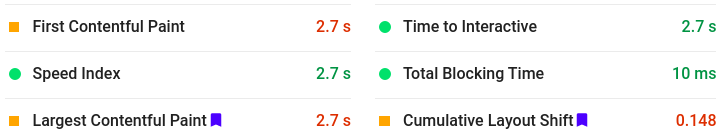
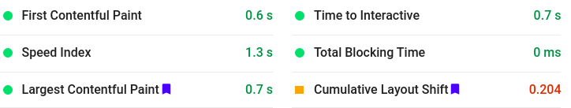
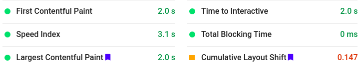

# 🔍 IPL Discovery

Search and filter about different IPL matches.

## :man_technologist: Technology Stack


-   [React](https://reactjs.org/)
-   [Sass](https://sass-lang.com/)

## :hatching_chick: Prerequisites

-   [node](https://nodejs.org/en/) >= 12.18.0
-   npm >= 6.14.4

## :zap: Installation

1. Clone / Download [this](https://github.com/khusharth/IPL-discovery) repo.
2. Inside the project open a terminal and run:

    ```
    npm install
    ```

    This will install all the project dependencies.

3. To start the development server run:
    ```
    npm start
    ```

## :cyclone: Page load speed

The Tool used to calculate page load time: [Google Page Speed Insights](https://developers.google.com/speed/pagespeed/insights/)

### :exclamation: Before Optimizing

### Desktop Page load time:



### Mobile Page load time:



### :sparkles: After Optimizing

For optimizing I removed the render-blocking resource which was google fonts in my case and instead of using fonts from google fonts I downloaded them.

### Desktop Page load time:



### Mobile Page load time:



-   **Desktop Page Load time:** 0.1 seconds were reduced.
-   **Mobile Page load time:** 0.7 seconds were reduced.

## :man_in_tuxedo: Author

[](https://twitter.com/khusharth19)

[](https://www.linkedin.com/in/khusharth/)
